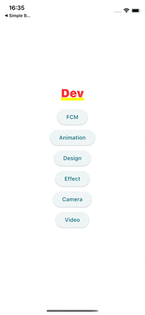
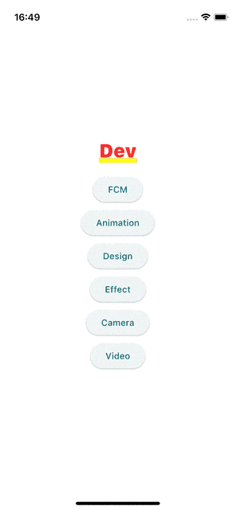
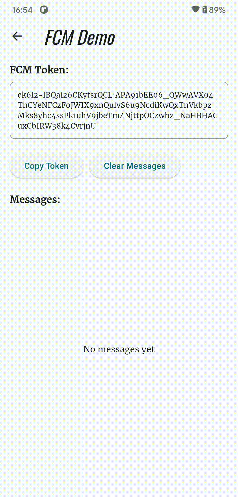

# phase_5

📺 Flutter Flavors (Android & iOS):
- Thiết lập Flutter Flavors để quản lý nhiều môi trường phát triển trong một dự án Flutter — gồm Dev, Staging, và Production.

🔧 Nội dung chính:
- Tổ chức mã nguồn: Tạo thư mục flavors để phân chia logic theo môi trường.
- FlavorConfig Singleton: Dùng để truy cập cấu hình môi trường toàn cục.
- Entry points riêng biệt: Tạo các file main_dev.dart, main_staging.dart, main_prod.dart.
- Cấu hình Android: Thiết lập productFlavors trong build.gradle.
- Cấu hình iOS: Tạo các scheme và target riêng trong Xcode.
- Tùy chỉnh tên và icon ứng dụng: Mỗi môi trường có thể có tên và biểu tượng riêng.
- Chạy và build theo flavor: Hướng dẫn cách chạy và build ứng dụng theo từng flavor trong Android Studio và Xcode.
- Tránh rò rỉ mã thử nghiệm vào bản sản xuất: Đảm bảo môi trường được cô lập rõ ràng.

📲 FCM Screen (Flutter + Firebase Cloud Messaging):
- Lấy và hiển thị FCM Token của thiết bị.
- Hiển thị thông báo cục bộ (local notification) khi nhận tin nhắn FCM trong trạng thái foreground.
- Ghi log lại các message FCM nhận được.
- Copy FCM Token và xóa lịch sử message.

  
  
  
  
  
  

